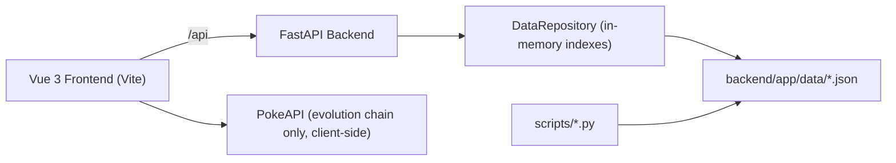

# Sursk.it


Sursk.it is a full-stack Pokemon data application focused on a Gen 3 PokeMMO workflow.
It ships as a monorepo with:

- a FastAPI backend that serves prebuilt JSON datasets
- a Vue 3 frontend for fast browsing/search
- build scripts that regenerate Pokemon/move/location/localization data

The repository is open to community contributions.

## Table of Contents

- [Why this project exists](#why-this-project-exists)
- [Features](#features)
- [Architecture](#architecture)
- [Repository layout](#repository-layout)
- [Requirements](#requirements)
- [Quick start (local development)](#quick-start-local-development)
- [Configuration](#configuration)
- [API reference](#api-reference)
- [Data pipeline](#data-pipeline)
- [Testing](#testing)
- [Build and deployment](#build-and-deployment)
- [Contributing](#contributing)
- [Attribution and legal](#attribution-and-legal)
- [License](#license)

## Why this project exists

The app is designed to keep tournament-prep information in one place: Pokemon, moves, and Hoenn encounter locations.  
Instead of scraping at runtime, it serves versioned data files from the repository for predictable performance and deploy stability.

Current branding/domain in the codebase:

- App name: `Sursk.it`
- Domain: `sursk.it`

## Features

- Typed JSON API with a consistent envelope format (`data`, `meta`, `error`).
- Pokemon search with combined filters:
  - text/id search (`q`)
  - one or multiple types (`type=grass,poison`)
  - EV yield filter (`ev_yield=speed`)
  - Hoenn-only toggle (`hoenn_only=true`)
  - move filter (`move=tackle`)
  - pagination (`limit`, `offset`)
- Move listing and detail view with:
  - learner lists
  - TM purchase metadata for Hoenn
  - legacy type normalization (Fairy -> Normal for PokeMMO compatibility)
- Hoenn location listing/detail endpoints with encounter tables, map links, and birdview images.
- English and Italian localization flow for API and UI.
- SPA served by the backend in production (single container deployment).

## Architecture



### Runtime behavior

- On startup, FastAPI loads JSON files into memory and builds indexes by id, name, type, and move.
- API routes use a service layer (`PokemonService`) backed by `DataRepository`.
- If frontend assets exist in `backend/static`, FastAPI mounts and serves the SPA.
- If frontend assets are missing, `/` returns an API-style status payload.

## Repository layout

```text
.
├── backend/
│   ├── app/
│   │   ├── api/               # FastAPI routes and dependencies
│   │   ├── core/              # app config + locale resolution
│   │   ├── data/              # committed JSON datasets
│   │   ├── providers/         # repository/data access layer
│   │   ├── schemas/           # pydantic models and API envelope
│   │   └── services/          # service layer
│   ├── requirements.txt
│   ├── requirements-dev.txt
│   └── tests/
├── frontend/
│   ├── src/
│   │   ├── api/               # typed API client
│   │   ├── components/
│   │   ├── pages/
│   │   ├── router/
│   │   ├── stores/
│   │   └── i18n/
│   └── package.json
├── scripts/                   # dataset/localization builders
├── Dockerfile
├── Makefile
└── render.yaml
```

## Requirements

- Python `3.14` (recommended, see `.python-version`)
- Node.js `22+` and npm
- Git

Optional:

- Docker (for one-container local/prod-like run)

## Quick start (local development)

### 1) Clone and create Python environment

```bash
git clone <your-fork-or-this-repo-url>
cd surskit
python3.14 -m venv .venv
source .venv/bin/activate
pip install -r backend/requirements-dev.txt
```

### 2) Run backend

```bash
cd backend
uvicorn app.main:app --reload
```

Backend URL: `http://localhost:8000`  
OpenAPI docs: `http://localhost:8000/docs`

### 3) Run frontend (second terminal)

```bash
cd frontend
npm install
npm run dev
```

Frontend URL: `http://localhost:5173`  
Vite proxies `/api` to `http://localhost:8000`.

### Makefile shortcuts

From repo root:

```bash
make backend
make frontend
make test
make build-data
```

## Configuration

### Backend environment variables

| Variable | Default | Description |
| --- | --- | --- |
| `APP_NAME` | `Sursk.it` | App name returned by root fallback response |
| `APP_DOMAIN` | `sursk.it` | Domain metadata returned by root fallback response |
| `FRONTEND_DIST` | `backend/static` | Folder mounted as SPA assets |

### Frontend environment variables

| Variable | Default | Description |
| --- | --- | --- |
| `VITE_API_BASE` | `/api` | Backend API base path |
| `VITE_POKEAPI_BASE` | `https://pokeapi.co/api/v2` | Used for evolution-chain requests in UI |

## API reference

All responses use this envelope:

```json
{
  "data": {},
  "meta": {},
  "error": null
}
```

Error responses:

```json
{
  "data": null,
  "meta": {},
  "error": {
    "code": "http_404",
    "message": "Pokemon '9999' not found",
    "details": null
  }
}
```

### Endpoints

| Method | Path | Notes |
| --- | --- | --- |
| `GET` | `/api/health` | Health probe |
| `GET` | `/api/pokemon` | List/search Pokemon |
| `GET` | `/api/pokemon/{pokemon_id}` | Pokemon detail |
| `GET` | `/api/pokemon/{pokemon_id}/moves` | Moves for one Pokemon |
| `GET` | `/api/moves` | Move list |
| `GET` | `/api/moves/{move_name}` | Move detail + learners |
| `GET` | `/api/locations` | Base location list |
| `GET` | `/api/locations/pokemmo/hoenn` | Hoenn-specific location list |
| `GET` | `/api/locations/pokemmo/hoenn/{location_name}` | Hoenn location detail |
| `GET` | `/api/meta/types` | List of Pokemon types present in dataset |

### Query params: `/api/pokemon`

| Param | Type | Default | Description |
| --- | --- | --- | --- |
| `q` | string | `null` | Name or number search (`25`, `#025`, `treecko`) |
| `type` | string | `null` | Comma-separated type filter (`grass,poison`) |
| `ev_yield` | string | `null` | EV stat filter (`speed`, `special-attack`, etc.) |
| `hoenn_only` | bool | `false` | Restrict ids to Gen 3 range |
| `move` | string | `null` | Filter Pokemon by move slug |
| `limit` | int | `24` | Page size (`1..100`) |
| `offset` | int | `0` | Page offset (`>= 0`) |

### Locale resolution

Locale is selected without a URL prefix:

- query override: `?lang=en` or `?lang=it`
- fallback: `Accept-Language` request header
- default: `en`

## Data pipeline

The app intentionally relies on pre-generated files in `backend/app/data`.
Core files include:

- `pokemon.json`
- `moves.json`
- `move_details.json`
- `locations.json`
- `pokemmo_hoenn_locations.json`
- `localization_it.json`
- `move_tm_hoenn_lookup.json`

### Scripts

| Script | Purpose | Writes |
| --- | --- | --- |
| `scripts/build_data.py` | Builds base Pokemon/move/location/move-detail data from PokeAPI | `pokemon.json`, `moves.json`, `locations.json`, `move_details.json` |
| `scripts/build_pokemmo_hoenn_locations.py` | Builds Hoenn encounter/location details from PokeMMO wiki (+ fallbacks) | `pokemmo_hoenn_locations.json` |
| `scripts/augment_hoenn_crossgen_pokemon.py` | Adds capturable Gen1/Gen2 entries seen in Hoenn encounter data | updates `pokemon.json` |
| `scripts/build_it_localization.py` | Builds Italian move/ability/location localization dataset | `localization_it.json` |

### Recommended regeneration order

```bash
source .venv/bin/activate
pip install -r backend/requirements-dev.txt

python3 scripts/build_data.py
python3 scripts/build_pokemmo_hoenn_locations.py
python3 scripts/augment_hoenn_crossgen_pokemon.py
python3 scripts/build_it_localization.py
```

Note:

- These scripts call external services and can take time.
- Commit regenerated data together with code changes that depend on it.

## Testing

Run backend tests from repository root:

```bash
source .venv/bin/activate
pytest
```

Current automated tests focus on API smoke/behavior checks (filters, localization, envelope shape).

## Build and deployment

### Docker (single deploy image)

Build:

```bash
docker build -t sursk-it .
```

Run:

```bash
docker run --rm -p 8000:8000 sursk-it
```

Open `http://localhost:8000`.

The Dockerfile:

- builds frontend assets in a Node stage
- installs backend deps in Python stage
- copies `frontend/dist` into `backend/static`
- serves both API + SPA from one FastAPI process

### Render

`render.yaml` is included for Docker-based deploys.  
Primary service config:

- type: `web`
- env: `docker`
- plan: `starter`
- autoDeploy: `true`

## Contributing

Contributions are welcome.

### Development workflow

1. Fork and clone the repository.
2. Create a feature branch.
3. Run the app locally (backend + frontend).
4. Run `pytest` before opening a PR.
5. If your change affects datasets, run the relevant build scripts and commit updated files.
6. Open a pull request with clear scope and testing notes.

### PR checklist

- Code is typed and readable.
- API responses keep the `ApiEnvelope` contract.
- Frontend handles loading and error states.
- Tests pass locally.
- Generated JSON changes are intentional and documented.

### Issue reports

Please include:

- expected behavior
- actual behavior
- reproduction steps
- relevant logs/screenshots
- OS + Python + Node versions

## Attribution and legal

This project references Pokemon-related data and community resources.
Primary sources used by scripts and/or UI:

- [PokeAPI](https://pokeapi.co/)
- [PokeMMO ShoutWiki](https://pokemmo.shoutwiki.com/wiki/Main_Page)
- [PokemonCentral Wiki](https://wiki.pokemoncentral.it/)
- [Bulbapedia / Bulbagarden Archives](https://bulbapedia.bulbagarden.net/)
- [PokeMMO Fandom Wiki](https://pokemmo.fandom.com/)

Pokemon is a trademark of Nintendo/Creatures Inc./GAME FREAK.
This repository is a fan-made informational project and is not affiliated with or endorsed by Nintendo, Game Freak, or The Pokemon Company.

## License

Code in this repository is licensed under the MIT License.  
See [LICENSE](./LICENSE).
